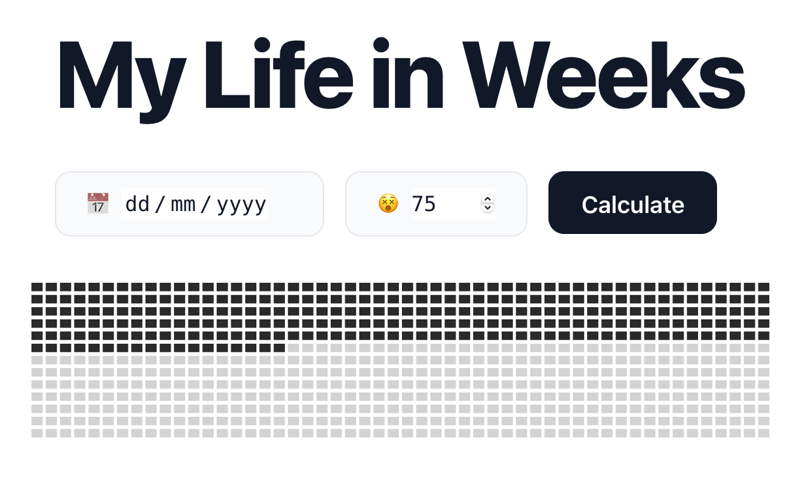

# My Life in Weeks 📅😵

[](https://app.netlify.com/sites/life-in-weeks/deploys)

<p align="center"> 
    
</p>

**_my-life-in-weeks_**

Life's progress made visible...

Visualising your life in weeks can feel weird and morbid to some but it can prove to be a good indicator of where you currently are in life.
This tool aims to be seen in a positive light and help you pursue a better future to maximise the time you have left.✈️🏖️🚵‍♂️🏄‍♂️

This is a project built using the [Svelte](https://svelte.dev) starter found [here](https://github.com/sveltejs/template) configured to use [TypeScript](https://www.typescriptlang.org/), [Tailwind](https://tailwindcss.com/) and [Rollup](https://rollupjs.org).

## Get started

Install the dependencies...

```bash
npm install
```

...then start the local development server by running

```bash
npm run dev
```

Navigate to [localhost:5000](http://localhost:5000). You should see your app running. Edit a component file in `src`, save it, and reload the page to see your changes.

## Build

To create an optimised version of the app, run

```bash
npm run build
```